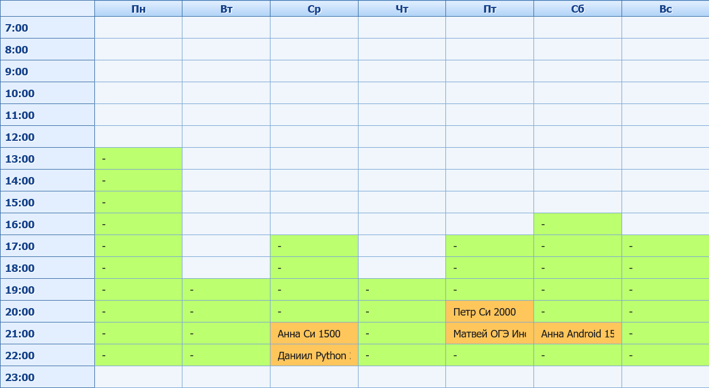
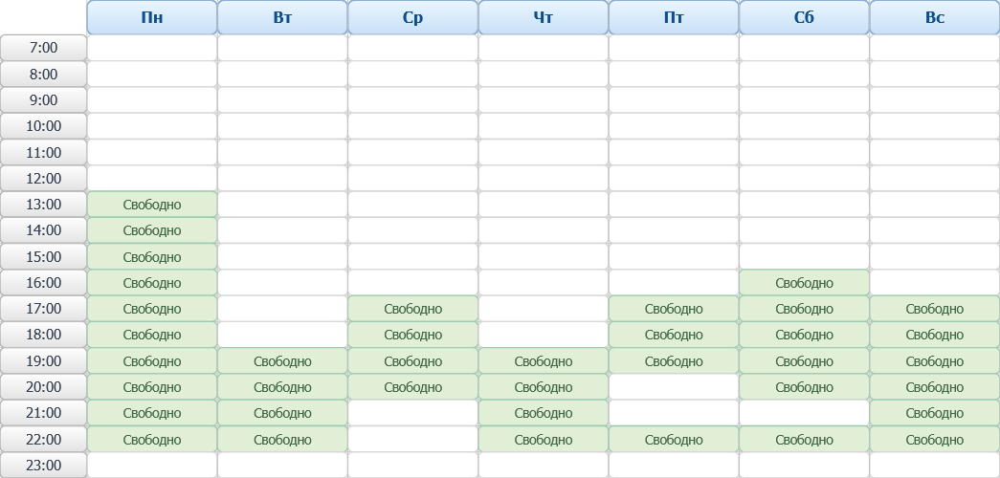
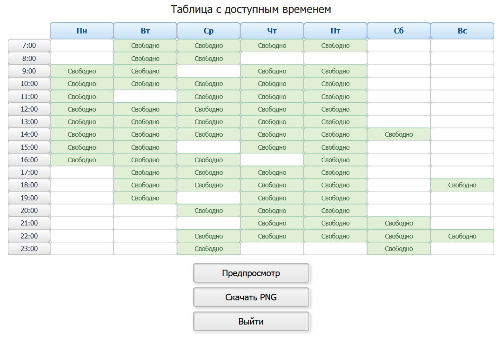

# TimetableManager | Управление расписанием для репетиторов

**TimetableManager** позволяет управлять расписанием занятий, отмечая доступное время, а также время, занятое учениками.

## Зачем это нужно?

Основная функция - формирование изображения с таблицей, содержащей информацию о доступном для записи на занятия времени.
Смысл данного изображения - в удобной форме донести до клиента выбор времени для занятия.

## Пример

Редактируемая таблица содержит ячейки, в которых "-" означает доступное для занятия время, а любой другой текст - что время занято занятием.



Генерируемая таблица содержит ячейки, в которых текст "Свободно" на зеленом фоне означает доступное для занятия время, а отсутствие текста - то, что время не доступно.



Предпросмотр таблицы передается в браузер в формате SVG, а для скачивания этот же SVG преобразуется в формат PNG. 
Нажатие на кнопку приводит к скачиванию файла в формате PNG.




## Запуск

Для minikube требуется индивидуальная настройка, базовый порядок команд содержится в `run.sh`.

Запуск dev-версии:

```sh
python manage.py migrate
python manage.py runserver
```